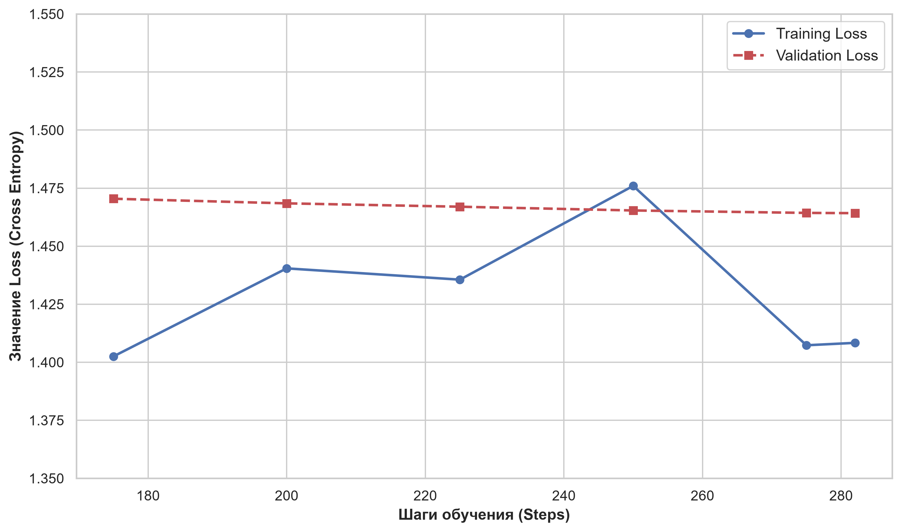
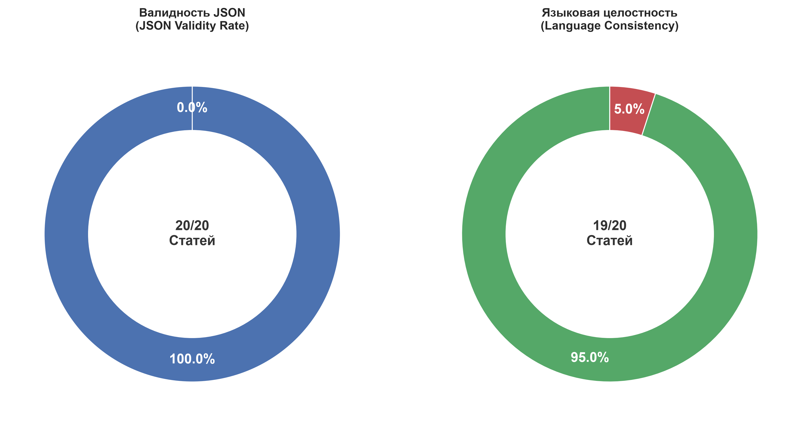
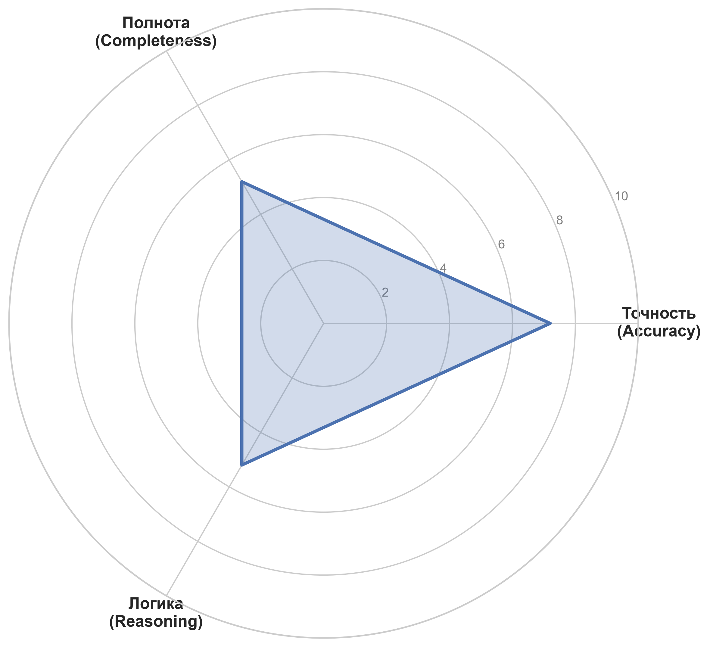
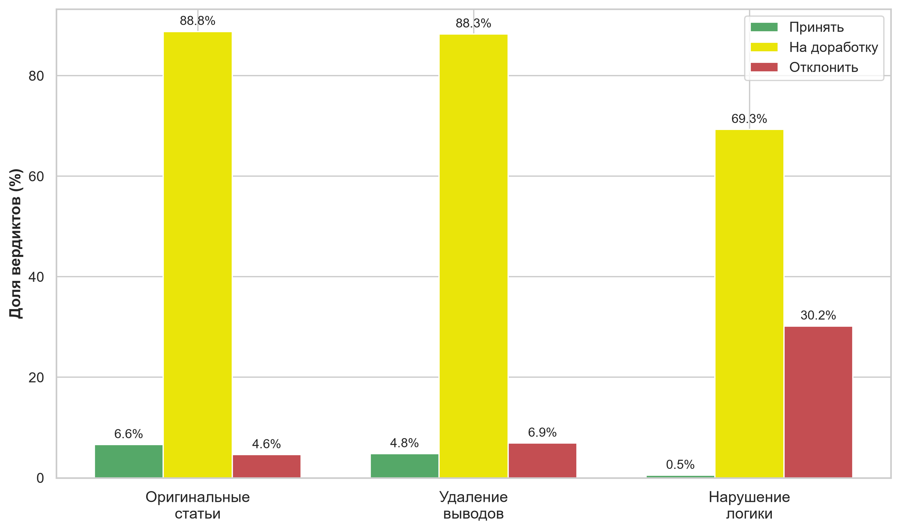
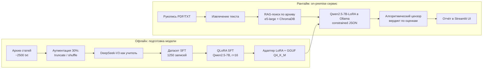

# 🎓 DSS Reviewer — авторецензирование научных статей на локальной LLM

**QLoRA-дообучение Qwen2.5-7B-Instruct (unsloth + TRL) → GGUF → Ollama → Streamlit + RAG**

[](https://github.com/Inartful/diploma/actions/workflows/ci.yml)


Система поддержки принятия решений (DSS) для предварительной экспертизы научных рукописей:
на вход — статья (PDF/TXT), на выход — структурированная рецензия (резюме, сильные и слабые
стороны, оценки методологии и новизны, черновой вердикт). Всё считается **on-premise**:
локальная модель в Ollama, локальный векторный архив для проверки новизны, никакие
рукописи не уходят во внешние API.

Проект сделан как ВКР и как демонстрация полного ML-цикла: генерация датасета →
дообучение с QLoRA → экспорт в GGUF → сервис с UI → измерение качества
(robustness + LLM-as-a-Judge) → разбор дефектов и их исправление.

### Repository map

```
notebooks/01_dataset_generation.ipynb    distillation: DeepSeek-V3 → 1250 SFT-пар
notebooks/02_lora_finetuning.ipynb       QLoRA SFT (r=16) + экспорт GGUF Q4_K_M
notebooks/03_evaluation.ipynb            robustness + LLM-as-a-Judge
app.py + src/                            Streamlit-сервис, RAG, детерминированный цензор
scripts/build_rag_index.py               сборка ChromaDB-индекса архива статей
reports/, docs/figures/                  метрики и графики экспериментов
```

---

## TL;DR (English)

An on-premise decision-support system for academic peer review. A synthetic review dataset
(1250 pairs) is distilled from DeepSeek-V3 with **structural augmentation** (30 % of texts are
truncated or have shuffled paragraphs so the model learns to reject weak papers), then
**Qwen2.5-7B-Instruct is fine-tuned with QLoRA** (`r=16`, 4-bit, unsloth, 282 steps,
`train_loss 0.67`) and exported to **GGUF Q4_K_M for Ollama**. The Streamlit app adds a
**RAG novelty check** (multilingual-e5-large + ChromaDB) and a **deterministic verdict
function** that overrides the model's own verdict to keep decisions reproducible.
Evaluation: 100 % valid JSON, 95 % language consistency (20 articles), and an
**LLM-as-a-Judge** run (accuracy 7.2 / completeness 5.2 / reasoning 5.2 out of 10) whose
findings are traced to concrete fixes in code. Everything runs locally; only dataset
generation uses an external teacher API.

---

## Ключевые результаты

| Что | Результат | Артефакт |
|---|---|---|
| Датасет (distillation) | 1250 записей, 0 битых JSON | `data/samples/dataset_sample.jsonl` |
| Аугментация | 69 % / 15.9 % / 15.0 % (original / shuffled / truncated) | `docs/results.md` |
| QLoRA SFT | `train_loss 0.6708`, `eval_loss 1.4642`, 282 шага, ~2.6 ч | `reports/training_stats.json` |
| JSON Validity Rate | **100 %** (20/20) | `docs/figures/metrics/robustness_metrics.png` |
| Language Consistency | **95 %** (19/20) | там же |
| LLM-as-a-Judge | точность **7.2**, полнота **5.2**, логика **5.2** / 10 | `reports/evaluation_results.jsonl` |




Полный разбор метрик, включая честный список того, что **не** измерено —
[`docs/results.md`](docs/results.md).




---

## Что в этой работе инженерно интересного

* **Датасет под задачу, а не «как получилось»**: 30 % примеров целенаправленно испорчены
  (обрезаны выводы / перемешаны абзацы), чтобы модель училась *отклонять* работы.
  Гипотеза проверена в EDA: на перемешанных текстах доля «Отклонить» растёт с ~5 % до ~30 %.
* **Асинхронная генерация**: 20 параллельных запросов к учителю, семафор, retry с
  экспоненциальной задержкой, валидация JSON до записи, дозапись с `flush` — прогон
  на 1250 статей не боится падений.
* **Два дефекта генерации найдены и закрыты кодом**:
  языковой сдвиг (constrained decoding + «якорь свежести» на русском) и рассогласование
  вердикта с оценками (детерминированный цензор вместо текстового решения модели).
* **RAG с корректными префиксами e5**: `query:`/`passage:` инкапсулированы в обёртке
  эмбеддингов, чтобы индекс и поиск жили в одном векторном пространстве.
* **Воспроизводимость**: единый `src/config.py`, `requirements*.txt`, тесты, CI,
  Docker + docker-compose, скрипт сборки индекса, скрипт публикации весов на HF Hub.

---

## Архитектура



Подробное описание решений (почему QLoRA, почему цензор, как устроен RAG) —
[`docs/architecture.md`](docs/architecture.md).

| Шаг | Ноутбук / модуль | Что делает |
|---|---|---|
| 1. Датасет | `notebooks/01_dataset_generation.ipynb` | асинхронно (20 потоков) размечает статьи учителем, аугментирует 30 % текстов, валидирует JSON |
| 2. Обучение | `notebooks/02_lora_finetuning.ipynb` | QLoRA SFT `r=16`, 2 эпохи (282 шага), сохранение адаптера и экспорт GGUF Q4_K_M |
| 3. Индекс | `scripts/build_rag_index.py` | чанкует архив статей и строит ChromaDB-индекс на `multilingual-e5-large` |
| 4. Модель | `modelfiles/Modelfile` | `ollama create qwen-reviewer` — шаблон чата, стоп-токены, `num_ctx=8192` |
| 5. Сервис | `app.py` + `src/` | Streamlit UI, RAG-контекст, генерация рецензии, цензор, отчёт |
| 6. Оценка | `notebooks/03_evaluation.ipynb` | robustness-тест (JSON + язык) и LLM-as-a-Judge с логами в `reports/` |

## Быстрый старт

### Вариант A: Docker (Ollama + UI одной командой)

```bash
# 1. GGUF (4.4 ГБ) положить в ./models/ — см. docs/model_card.md
mkdir -p models && cp qwen-reviewer_gguf/qwen2.5-7b-instruct.Q4_K_M.gguf models/

# 2. Поднять сервисы
docker compose up -d --build

# 3. Зарегистрировать модель в Ollama
docker compose exec ollama ollama create qwen-reviewer -f /modelfiles/Modelfile

# 4. (Опционально) собрать RAG-индекс, нужен dataset/data_3 с .txt
docker compose exec app python scripts/build_rag_index.py

# UI: http://localhost:8501
```

### Вариант B: локально

```bash
# окружение
python -m venv .venv && source .venv/bin/activate   # Windows: .venv\Scripts\activate
pip install -r requirements.txt

# Ollama + модель
ollama pull qwen2.5:7b-instruct        # базовая модель (если нет своей сборки)
ollama create qwen-reviewer -f modelfiles/Modelfile

# архив статей для RAG (в репозитории его нет) -> папка dataset/data_3/*.txt
python scripts/build_rag_index.py

# запуск UI
streamlit run app.py
```

Проверка без GPU и без Ollama: `pytest` (юнит-тесты цензора, схем и метрики языка),
`ruff check .`, `python scripts/check_notebooks.py`.

### Переменные окружения

```bash
cp .env.example .env
# CHUTES_API_TOKEN — только для ноутбуков 01/03 (генерация датасета и LLM-судья)
# OLLAMA_URL / MODEL_NAME — переопределяют адрес инференса (используется в docker-compose)
```

---

## Структура репозитория

```
.
├─ app.py                        # Streamlit-энтрипоинт (UI)
├─ src/                          # переиспользуемые модули
│   ├─ config.py                 # пути/настройки, env-overridable
│   ├─ schemas.py                # JSON-схемы Ollama + маппинг RU/EN ключей
│   ├─ ollama_client.py          # промпты, constrained decoding, валидация ответа
│   ├─ censor.py                 # детерминированный вердикт по оценкам
│   ├─ quality.py                # метрика языковой консистентности
│   ├─ documents.py              # извлечение текста из PDF/TXT
│   └─ rag.py                    # e5-эмбеддинги, поиск, построение индекса
├─ notebooks/
│   ├─ 01_dataset_generation.ipynb
│   ├─ 02_lora_finetuning.ipynb
│   └─ 03_evaluation.ipynb
├─ scripts/
│   ├─ build_rag_index.py        # сборка ChromaDB-индекса из архива статей
│   ├─ publish_to_hub.py         # публикация LoRA/GGUF на HuggingFace Hub
│   └─ check_notebooks.py        # CI-проверка: ноутбуки без сохранённых выводов
├─ tests/                        # pytest: цензор, схемы, метрика языка
├─ data/samples/                 # 10 записей датасета (полный — 68 МБ, не в git)
├─ examples/sample_article.txt   # синтетическая статья для smoke-теста
├─ reports/                      # метрики прогонов (training_stats, evaluation_results)
├─ docs/
│   ├─ architecture.md           # схема пайплайна и разбор решений
│   ├─ results.md                # метрики, включая то, что не измерено
│   ├─ model_card.md             # карточка модели + инструкция публикации весов
│   └─ figures/{metrics,thesis}/ # графики (метрики и рисунки из текста ВКР)
├─ modelfiles/Modelfile          # конфигурация модели для Ollama
├─ Dockerfile / docker-compose.yml
└─ .github/workflows/ci.yml      # ruff + pytest + гигиена ноутбуков
```

## Данные и артефакты

| Артефакт | Размер | Где лежит |
|---|---|---|
| Синтетический датасет (1250 записей) | ~68 МБ | не в git; формат — `data/samples/dataset_sample.jsonl` |
| Архив статей eLibrary (~2500 txt) | ~40 МБ | не в git (сторонние публикации) |
| LoRA-адаптер | ~150 МБ | не в git → HuggingFace Hub (`docs/model_card.md`) |
| GGUF Q4_K_M | ~4.4 ГБ | не в git → HuggingFace Hub / релиз |
| ChromaDB-индекс | ~10 МБ | воспроизводится `scripts/build_rag_index.py` |
| Метрики и графики | < 10 МБ | в git (`reports/`, `docs/figures/`) |

В `.gitignore` жёстко закрыты `.env`, веса (`*.gguf`, `*.safetensors`, `*.bin`, `*.pt`),
датасеты (`*.jsonl` с исключением для сэмпла и отчётов), логи и кэш ноутбуков.

## Ограничения

* **Нет baseline без LoRA** — эффект дообучения количественно не отделён от эффекта промпта.
* **Судья — тоже LLM**, со своими смещениями; человеческой оценки нет.
* **Датасет смещён** к вердикту «Отправить на доработку» (85.6 %), поэтому модель редко
  уверенно принимает статьи.
* **Выборки маленькие**: robustness — 20 статей, LLM-as-a-Judge — 5 (часть рыночных цифр
  в графиках — из более широкого прогона; это явно помечено в `docs/results.md`).
* **Пороги цензора** (4 / 7 / 6) взяты эмпирически, без калибровки по разметке эксперта.
* **Языковой сдвиг** полностью не исключён: 1 кейс из 20.

## Roadmap

- [ ] Прогнать baseline (`Qwen2.5-7B-Instruct` без адаптера) на тех же 20 статьях и посчитать дельту.
- [ ] Расширить judge-прогон до 50–100 статей с сохранением полного лога.
- [ ] Калибровка порогов цензора по разметке эксперта (несколько рецензентов).
- [ ] Попробовать `r=32` и 3 эпохи — `eval_loss` не вышел на плато.
- [ ] Опубликовать датасет и веса на HuggingFace Hub, добавить бейджи со ссылками.
- [ ] Оценка близости рецензии к человеческой (BERTScore/ROUGE + ручная экспертиза).

## Стек

**ML:** PyTorch, unsloth, TRL/`SFTTrainer`, PEFT (QLoRA), Transformers, Datasets, bitsandbytes
**Данные:** pandas, numpy, seaborn/matplotlib, asyncio + OpenAI SDK (Chutes API для учителя/судьи)
**Сервис:** Streamlit, Ollama (GGUF Q4_K_M), LangChain Community (Chroma), sentence-transformers (`multilingual-e5-large`), PyPDF2
**Инженерия:** ruff, pytest, GitHub Actions, Docker / docker-compose

## Лицензия

Код — MIT (см. [LICENSE](LICENSE)). Базовая модель Qwen2.5 распространяется по Apache-2.0;
тексты статей из архива eLibrary в репозитории не публикуются.

## Автор

Илья Корляков — ВКР, 2026. Вопросы и предложения — через Issues.

