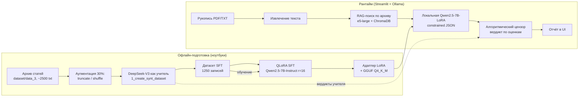

# Архитектура и принятые решения

## 1. Что это за система

DSS (Decision Support System) для **предварительной экспертизы научных рукописей**:
помогает редактору/рецензенту быстро получить структурированную справку по статье —
резюме, сильные и слабые стороны, оценки методологии и новизны, черновой вердикт.

Система разворачивается **on-premise** (данные рукописей не уходят наружу):
локальная модель в Ollama + локальный векторный архив для проверки новизны.

## 2. Пайплайн

## 3. Ключевые решения и почему именно так

### 3.1 Дистилляция вместо разметки людьми
Разметка тысяч статей рецензентом-человеком недоступна, поэтому учителем выступает
сильная модель (DeepSeek-V3) — стандартный для 2024–2025 подхода distillation.
Ограничение осознаётся: модель наследует смещения учителя (см. `results.md`, §5).

### 3.2 Структурная аугментация 30 % примеров
Ключевая гипотеза работы: если обучать только на «нормальных» статьях, модель
научится писать шаблонные положительные отзывы. Поэтому:
* 15 % текстов обрезаются вместе с выводами (`truncated_no_conclusions`);
* 15 % — перемешиваются абзацы (`shuffled_logic`) → теряется логика изложения.

Проверка гипотезы — в EDA (ноутбук 01, блок 2): на перемешанных текстах доля
«Отклонить» вырастает с ~5 % до ~30 %.

### 3.3 QLoRA 4-bit + unsloth
7B-модель в fp16 не помещается в одну потребительскую GPU. QLoRA (`r=16`,
`alpha=16`, все 7 линейных проекций) обучает ~0.5 % параметров и позволяет
уложиться в бюджет по VRAM. `unsloth` даёт ускорение и экономию памяти за счёт
своих Triton-ядер для SFT.

### 3.4 Constrained decoding + «якорь свежести»
Наблюдаемый дефект: на статьях с английским abstract модель после LoRA
«сваливалась» в английский язык внутри JSON. Решение двухслойное:
1. `format=<JSON schema>` в Ollama → грамматически невозможно вернуть невалидный
   JSON или другие имена полей;
2. инструкция отвечать по-русски продублирована **в конце** промпта (позднее
   напоминание весит больше, чем системный промпт).

### 3.5 Детерминированный «алгоритмический цензор»
LLM выставляет оценки и текстовый вердикт независимо, и они расходятся
(LLM-судья снижает балл именно за это). Поэтому итоговое решение считает чистая
функция от двух чисел (`src/censor.py`), а текстовый вердикт модели остаётся
в UI как «мнение модели». Это делает поведение системы воспроизводимым
и объяснимым для редактора — важное требование к DSS.

### 3.6 RAG для проверки новизны
Оценка новизны без доступа к внешним базам — самая слабая часть LLM-рецензента.
В системе реализован локальный RAG: архив выгрузок eLibrary индексируется
`multilingual-e5-large` в ChromaDB; топ-3 близких фрагмента подмешиваются
в промпт как контекст «что уже публиковалось».
Техническая деталь: у e5 обязательны префиксы `query:` / `passage:`, иначе
косинусная близость считается на несогласованных пространствах — это
инкапсулировано в `E5Embeddings` (`src/rag.py`).

## 4. Карта модулей

| Модуль | Ответственность |
|---|---|
| `app.py` | Streamlit UI: загрузка файла, прогресс, отрисовка отчёта |
| `src/config.py` | единые настройки и пути (env-overridable для docker-compose) |
| `src/schemas.py` | JSON-схемы Ollama + маппинг RU/EN ключей |
| `src/ollama_client.py` | вызов локальной модели, промпты, валидация JSON |
| `src/censor.py` | детерминированный вердикт по оценкам |
| `src/quality.py` | метрика языковой консистентности ответа |
| `src/documents.py` | извлечение текста из PDF/TXT |
| `src/rag.py` | эмбеддинги e5, поиск и сборка контекста, построение индекса |
| `scripts/build_rag_index.py` | сборка ChromaDB-индекса из архива |
| `scripts/publish_to_hub.py` | публикация LoRA/GGUF на HuggingFace Hub |
| `scripts/check_notebooks.py` | CI-проверка «чистоты» ноутбуков |
| `notebooks/01..03` | генерация датасета → обучение → оценка |

## 5. Известные слабости архитектуры

* ~~RAG-индекс собирался вне репозитория~~ — исправлено: `scripts/build_rag_index.py`.
* Английские ключи в датасете vs русские в рантайме — историческое расхождение,
  теперь явно описано и замаплено в `src/schemas.py` (`to_russian_keys`).
* Единая точка отказа — Ollama: при недоступности модели UI показывает ошибку,
  но не деградирует в «эвристический» режим.
* Пороги цензора (4/7/6) подобраны эмпирически, без разметки эксперта;
  калибровка — в roadmap.
